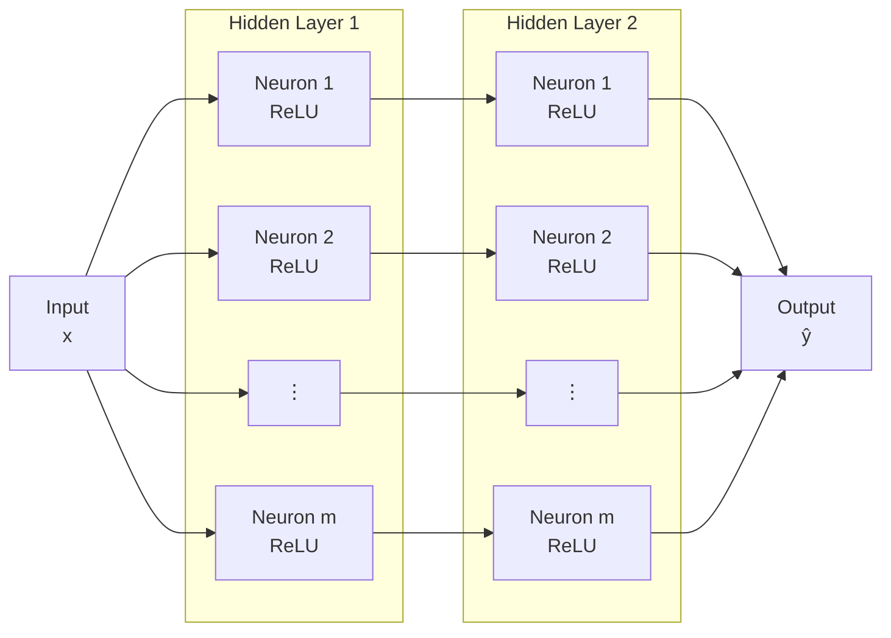

# ReLUNet : a tiny ReLU Neuronal Network

[](https://github.com/maximilien-mahdhi/relunet/actions/workflows/ci.yml)
[](https://www.python.org/)
[](https://numpy.org/)
[](https://matplotlib.org/)
[](https://docs.pytest.org/)
[](https://docs.astral.sh/ruff/)

*Last update : 05/10/2026*

## Author
*Maximilien MAHDHI – 08/12/2025*

## Overview

A two-layer ReLU network, 
$$\forall \, x \in \mathbb{R}, \quad f_w(x) := \frac{1}{m} \sum_{j=1}^m a_j \max(0, b_j x + c_j)$$
with weights $w := (a_j, b_j, c_j)_{j=1}^m \in \mathbb{R}^{3m}$, is fitted to a small 1D regression dataset $(x_i, y_i)_{i=1}^n \subset \mathbb{R}^2$ using gradient descent written from scratch in NumPy (forward pass, backward pass, and optimizers). 
<br> This repository collects a set of experiments exploring the optimization and generalization behavior of the model.

### Neural Network Architecture

The network takes a scalar input $x \in \mathbb{R}$ and consists of two hidden layers,
each containing $m \geq 1$ ReLU neurons, which outputs a prediction $\hat{y} \in \mathbb{R}$ of the right "label" $y \in \mathbb{R}$.



The weights $w$ of the network are initialized as follows:
$$\forall \, j \in \{1, \dots, m\}, \quad a_j \sim \mathcal{N}(0, \alpha_{\text{outer}}) \quad \text{and} \quad b_j, c_j \sim \mathcal{N}(0, \alpha_{\text{inner}})$$
where $\alpha_{\text{outer}}, \alpha_{\text{inner}} \geq 0$ are the variances for the outer and inner weights, respectively.

The goal of this project is to study the behavior of a neural network in a low-dimensional context (1D / single feature) with very few layers, enabling a direct visualization of the predictive function $f_w$.

## Experiments

| Name | What it studies | Observation |
|------|-----------------|-------------|
| `hand-fit` | Zero training loss reached by hand with 4 ReLU units | The weights computed by hand interpolate the training data. <br> A global minimizer $w_*$ exists $\iff m \geq 4$ (not unique : there is an infinite number of solutions). 
| `gd-vs-sgd` | Full-batch GD vs SGD from identical initial weights | In this non-convex setting SGD reaches a lower final loss, while GD settles in a suboptimal minimum and underfits. |
| `init-scales` | Initialization scales $\alpha_{outer}, \alpha_{inner} \geq 0$ | $\alpha_{outer/inner} \lesssim 0.1$ train slowly (vanishing initial gradients); fun fact : $\nabla L_\lambda(0_{3m}) = 0_{3m}$. <br> $0.5 \lesssim \alpha_{outer/inner} \lesssim 1.0$ yields fast, stable convergence and gives the best fit. |
| `width` | Number of neurons $m \geq 1$ | Narrow networks $(m \leq 3)$ underfit; test loss is best around $m = 10$ and grows for larger $m$ (overfitting). Again, a global minimizer $w_*$ exists $\iff m \geq 4$. |
| `learning-rates` | Step size / Learning rate $\eta > 0$ | Very small steps converge slowly, large ones $(\text{e.g.} \, \, \eta = 5, \eta = 10)$ oscillate in suboptimal minima; $0.1 \lesssim \eta \lesssim 1.0$ works best. |
| `weight-decay` | $\ell^2$-regularization with SGD : $\lambda\lVert w \rVert_2, \lambda \geq 0$ | Weight decay shrinks the squared norm of the weights ($f_w$ becomes smoother); a small $\lambda$ $(\text{e.g.} \, \, \lambda = 10^{-3})$ improves generalization, a large one $(\text{e.g.} \, \, \lambda = 0.1)$ underfits. |
| `freeze-inner` | Training all weights vs the outer layer only (convex) | Freezing the inner layer converges faster but is limited by the random ReLU features drawn at initialization. |

## Installation

```bash
git clone https://github.com/<user>/relunet.git
cd relunet
pip install -e ".[dev]"
```

## Usage

The data is expected in `data/` (`train_data.npy` and `test_data.npy`, each of shape `(2, n)`).

```bash
python scripts/run_experiment.py gd-vs-sgd                # display the figure
python scripts/run_experiment.py all --save-dir results   # run everything, save PNG files
python scripts/run_experiment.py width --log-level DEBUG  # verbose training logs
```

Options: `--data-dir`, `--save-dir`, `--seed` (default 55), `--log-level`.

## Repository layout

```
relunet/
├── data/                          # 1D regression datasets
│   ├── train_data.npy             # Training samples (shape: 2 x n)
│   └── test_data.npy              # Hold-out evaluation samples
│
├── src/
│   └── relunet/                   # Core package
│       ├── __init__.py            # Package exposure & versioning
│       ├── model.py               # Two-layer ReLU network architecture & analytical gradients
│       ├── training.py            # GD / SGD routines & outer-layer convex optimizer
│       ├── experiments.py         # Full benchmark suite execution logic
│       ├── plotting.py            # Matplotlib visualizers & publication-ready styling
│       ├── data.py                # Dataset loaders & pre-processing pipelines
│       └── logger.py              # Structured logging & stdout handlers
│
├── scripts/
│   └── run_experiment.py          # CLI entry point with argparse & flexible configs
│
├── tests/                         # Test suite
│   ├── conftest.py                # Pytest fixtures & reproducible seeds
│   ├── test_model.py              # Forward pass & gradient checks (finite differences)
│   └── test_training.py           # Convergence & optimization assertions
│
├── results/                       # Generated outputs (.png, experiment logs)
├── pyproject.toml                 # Package metadata, Ruff & Pytest configuration
├── README.md                      # Project documentation
└── .gitignore                     # Git exclusion rules
```

## Development

```bash
ruff check .
pytest
```
