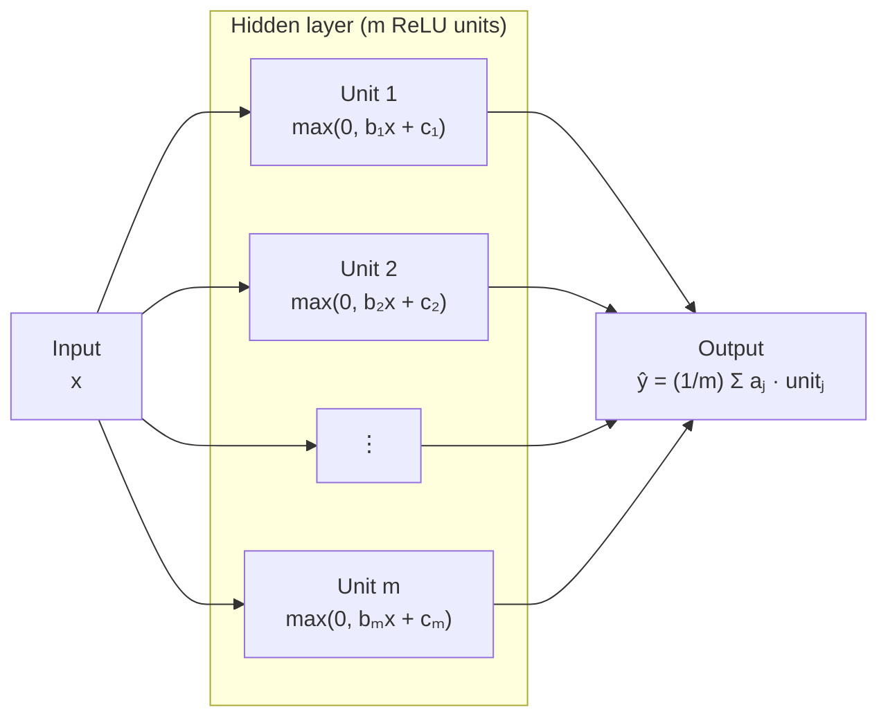

<div align="center">

# 🧠 relunet 🧠

**A tiny ReLU neural network, trained from scratch with NumPy on 1D regression**

Forward and backward passes · GD and SGD · seven experiments on optimization and generalization

<sub>Course project of <a href="https://kernel-learning.github.io"><i>From Basic Machine Learning models to Advanced Kernel Learning</i></a> (Julien Mairal, Scott Pesme and Michael Arbel, Université Grenoble Alpes)</sub>

<a href="https://github.com/maximilien-mahdhi"></a>

<b>Maximilien MAHDHI</b><br>
<sub>Design and implementation · <a href="https://github.com/maximilien-mahdhi">GitHub</a> · <a href="https://www.linkedin.com/in/maximilien-mahdhi">LinkedIn</a></sub>

[](https://github.com/maximilien-mahdhi/relunet/actions/workflows/ci.yml)


</div>

## Table of contents

- [Overview](#overview)
- [Installation](#installation)
- [Quick start](#quick-start)
- [Experiments](#experiments)
- [Model and notation](#model-and-notation)
- [Project structure](#project-structure)
- [Development and design notes](#development-and-design-notes)
- [Author](#author)
- [References](#references)

---

## Overview

A two-layer ReLU network with $m$ hidden units,

$$f_w(x) := \frac{1}{m} \sum_{j=1}^m a_j \max(0,\, b_j x + c_j), \qquad x \in \mathbb{R},$$

with weights $w := (a_j, b_j, c_j)_{j=1}^m \in \mathbb{R}^{3m}$, is fitted to a small 1D regression dataset $(x_i, y_i)_{i=1}^n \subset \mathbb{R}^2$. The forward pass, the backward pass and the optimizers are all written from scratch in NumPy.

This project was carried out as part of the course [*From Basic Machine Learning models to Advanced Kernel Learning*](https://kernel-learning.github.io), taught at Université Grenoble Alpes by Julien Mairal, Scott Pesme and Michael Arbel.

The goal is to study the behavior of a neural network in a low-dimensional setting (one input feature, one hidden layer), where the predictor $f_w$ can be plotted directly. The repository collects seven experiments on optimization and generalization.

| Topic | What is implemented |
| --- | --- |
| **Model** | Two-layer ReLU network with analytical gradients, checked against finite differences |
| **Training** | Full-batch gradient descent, SGD, $\ell^2$-weight decay, outer-layer-only (convex) training |
| **Experiments** | Seven reproducible experiments with figures, run from a single command-line entry point |
| **Quality** | Unit tests, Ruff, continuous integration |

## Installation

The instructions below target Linux (Debian/Ubuntu).

```bash
git clone https://github.com/maximilien-mahdhi/relunet.git
cd relunet
python3 -m venv .venv
source .venv/bin/activate
pip install -e ".[dev]"
```

## Quick start

The data is expected in `data/`: `train_data.npy` and `test_data.npy`, each of shape `(2, n)` (first row: inputs, second row: labels).

```bash
python scripts/run_experiment.py gd-vs-sgd                # display the figure
python scripts/run_experiment.py all --save-dir results   # run everything, save PNG files
python scripts/run_experiment.py width --log-level DEBUG  # verbose training logs
```

| Option | Default | Description |
| --- | --- | --- |
| `--data-dir` | `data` | Directory containing `train_data.npy` and `test_data.npy` |
| `--save-dir` | none | Save the figures there instead of displaying them |
| `--seed` | `55` | Seed of the random number generator |
| `--log-level` | `INFO` | `DEBUG`, `INFO`, `WARNING` or `ERROR` |

## Experiments

Each experiment is selected by name (`all` runs the seven of them).

| Name | What it studies | Observation |
| --- | --- | --- |
| `hand-fit` | Zero training loss reached by hand with 4 ReLU units | The weights computed by hand interpolate the training data. A global minimizer $w_*$ exists if and only if $m \geq 4$ (it is not unique: there is an infinite number of solutions). |
| `gd-vs-sgd` | Full-batch GD vs SGD from identical initial weights | In this non-convex setting SGD reaches a lower final loss, while GD settles in a suboptimal minimum and underfits. |
| `init-scales` | Initialization scales $\alpha_{\text{outer}}, \alpha_{\text{inner}} \geq 0$ | Scales $\lesssim 0.1$ train slowly (vanishing initial gradients; note that $\nabla L_\lambda(0_{3m}) = 0_{3m}$). Scales in $[0.5, 1.0]$ give fast, stable convergence and the best fit. |
| `width` | Number of neurons $m \geq 1$ | Narrow networks ($m \leq 3$) underfit. The test loss is best around $m = 10$ and grows for larger $m$ (overfitting). Again, a global minimizer exists if and only if $m \geq 4$. |
| `learning-rates` | Step size $\eta > 0$ | Very small steps converge slowly; large ones (e.g. $\eta = 5$ or $10$) oscillate in suboptimal minima. $0.1 \lesssim \eta \lesssim 1.0$ works best. |
| `weight-decay` | $\ell^2$ regularization with SGD, $\lambda \geq 0$ | Weight decay shrinks the squared norm of the weights, so $f_w$ becomes smoother. A small $\lambda$ (e.g. $10^{-3}$) improves generalization; a large one (e.g. $0.1$) underfits. |
| `freeze-inner` | Training all weights vs the outer layer only (convex) | Freezing the inner layer converges faster but is limited by the random ReLU features drawn at initialization. |

## Model and notation

The network takes a scalar input $x \in \mathbb{R}$, applies $m \geq 1$ ReLU units and outputs a prediction $\hat y = f_w(x) \in \mathbb{R}$ of the label $y$. Each hidden unit $j$ has an input weight $b_j$, a bias $c_j$ and an output weight $a_j$.



The weights are initialized as

$$a_j \sim \mathcal{N}(0, \alpha_{\text{outer}}) \quad \text{and} \quad b_j, c_j \sim \mathcal{N}(0, \alpha_{\text{inner}}), \qquad j = 1, \dots, m,$$

where $\alpha_{\text{outer}}, \alpha_{\text{inner}} \geq 0$ are the variances of the outer and inner weights.

## Project structure

```
relunet/
├── data/                          # 1D regression datasets
│   ├── train_data.npy             # training samples (shape: 2 x n)
│   └── test_data.npy              # hold-out evaluation samples
├── src/relunet/                   # core package
│   ├── __init__.py                # package exposure and version
│   ├── model.py                   # two-layer ReLU network and analytical gradients
│   ├── training.py                # GD / SGD routines and outer-layer convex optimizer
│   ├── experiments.py             # experiment suite
│   ├── plotting.py                # Matplotlib figures and styling
│   ├── data.py                    # dataset loaders
│   └── logger.py                  # structured logging
├── scripts/run_experiment.py      # command-line entry point
├── tests/
│   ├── conftest.py                # fixtures and reproducible seeds
│   ├── test_model.py              # forward pass and gradient checks (finite differences)
│   └── test_training.py           # convergence and optimization assertions
├── results/                       # generated figures and logs
├── pyproject.toml                 # packaging, Ruff and pytest configuration
└── README.md
```

## Development and design notes

```bash
ruff check . && ruff format --check .
pytest
```

- **Gradients.** The backward pass is written by hand and checked against finite differences in `tests/test_model.py`.
- **Reproducibility.** Every experiment is seeded (`--seed`, default 55); GD and SGD start from the same initial weights where they are compared.
- **Logging.** Library code only calls `logging.getLogger(__name__)`; handlers are configured once by the entry point.
- **Scope.** The dataset is tiny and one-dimensional on purpose. The observations above describe this dataset and these hyperparameter ranges, not general rules.

## Author

**Maximilien MAHDHI**, M2 MSIAM, Université Grenoble Alpes. [GitHub](https://github.com/maximilien-mahdhi) · [LinkedIn](https://www.linkedin.com/in/maximilien-mahdhi)

## References

- J. Mairal, S. Pesme, M. Arbel, [*From Basic Machine Learning models to Advanced Kernel Learning*](https://kernel-learning.github.io), course, Université Grenoble Alpes.